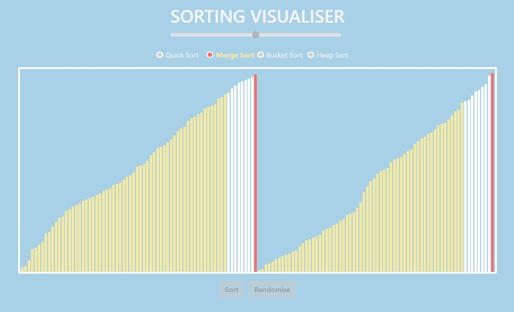

# Sorting algorithms

## Sorts
*Pure js functions can be found in public/algo-pure-js*
#### Current:
- quick sort
- merge sort
- bucket sort
- heap sort

#### To-do:
- bubble sort
- shell sort

## Visuals



#### Tips for creating the visualisation:
- Never start with the entire function; always start with the helper functions. Run it once on an isolated array and see if the function and DOM works as expected.
- After that, start adding in the colours and async/await
- At first, I coded the visuals by shifting HTML elements around. That, I found, gave lots of problems because sometimes you would have to clone the elements and they would get 'lost', and you would have a hard time selecting what you want. This is why I think it is far better to code the visuals by modifying the HTML elements' attributes.

#### Understanding heap sort:
- Of the sorts, heap was the hardest to understand and code. Thought I'd record here how I got about it.
- Understanding: 
    - The heap sort consists of 2 parts -- (1) the process of rearranging the array so that if all the elements are placed in a binary tree, the parent node will always be larger than the child nodes (this is also called the *heapify* function), and (2) swapping the root node i.e. the largest node with the last node, removing the root node and then running the first process of rearrangement again.
    - This way, the largest node/element will always be removed and placed in the final, sorted array.
- Coding: 
    - The formula for selecting the parent and child nodes within a binary tree is, with a parent indexed **i** in an array: **2i + 1** for the left child node and **2i + 2** for the right child node.
    ```
    let arr = [3, 1, 5, 7, 9, 4, 6]
                    3
            1               5
        7       9       4       6
    
    # you'll notice that if we take the parent node 3, it is indexed at [0], while the child nodes 1 and 5 are indexed at [2i + 1 = 1] and [2i + 2 = 2] respectively.
    ```
    - The first step, as mentioned above, is to rearrange the array, or *heapify* it. We only need to start from the middle of the array, or node 5, since the nodes below are not parent to any child nodes.
    - Ok I'm too lazy to type it all out here. You can find them in the public/js folder; I wrote them as I wrote the code.
    - The visualisation was done a little differently from the other sorting algorithms. In the others, I was rearranging the HTML elements. Whereas for the heap sort, I manipulated the attributes of the HTML elements -- that, I realised, is a far less problem-prone method.


#### Other to-do:
- Include option to sort ascending/descending
- Include option for evenly distributed bar heights/random
- Improve radio buttons; a little hard to click on that tiny dot